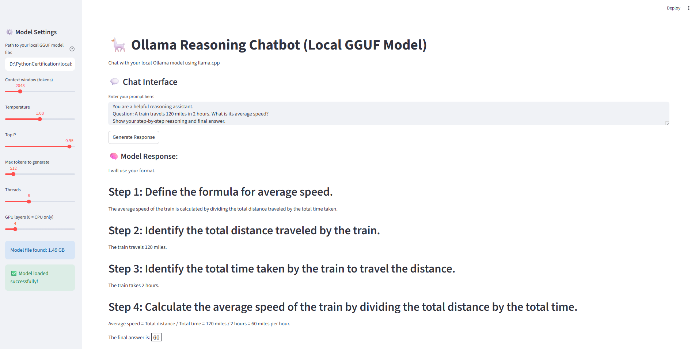

# 🦙 Ollma -3.2-3B-Instruct-IQ3_M GGUF Reasoning Chatbot (Local GGUF Model)

A **local chatbot interface** built with [Streamlit](https://streamlit.io/) and powered by the **Ollama-3.2-3B-Instruct-IQ3_M.gguf GGUF** model, running through [llama-cpp-python](https://github.com/abetlen/llama-cpp-python).  
This project lets you chat with the **Ollama-3.2-3B-Instruct-IQ3_M GGUF model locally** — **no API keys, no cloud costs**, just your CPU/GPU.

---

## 🚀 Features
- 🧠 Runs Ollama-3.2-3B-Instruct-IQ3_M locally (GGUF format)
- 💬 Streamlit web UI for chatting
- ⚙️ Configurable model parameters (temperature, top-p, max tokens, etc.)
- 🖥️ Works fully offline once model is downloaded
- 🪶 Lightweight and customizable

---

## 🧩 Prerequisites

Before you start, ensure you have ( at the time of buidling, i had VS2022 Community, Windows 10, Python 3.11):
- **Windows 10/11 (64-bit)**
- **Python 3.10+ (64-bit)** — recommended: Python 3.11
- **Git**
- **CMake (latest version)**
- **Visual Studio Build Tools** (for C++ compilation)

---

## 🛠️ Installation Steps ( If you have all the pre-requisites in place for Windows 10/11 OS. Might differ for Linux based OS)

### 1️. Clone the repository
```bash
git clone https://github.com/venki231blr922/jambachatbot.git
cd jambachatbot
```
### All of the below commands were executed from **Developer Command Prompt** ( part of the visual studio build tools), which made it easier for me to execute the application without issues.

### 2️. Create and activate a virtual environment
```bash 
python -m venv venv
venv\Scripts\activate
```

### 3. Install required python packages
```bash
pip install --upgrade pip setuptools wheel
pip install -r requirements.txt
```
if the above doesn't work
Try the below
```
py -m pip install --upgrade pip setuptools wheel
pip install -r requirements.txt
```
### 4. Run the Streamlit Chatbot
From the project root
```bash
streamlit run app.py
```
Then open the browser
```
http://localhost:8501
```

🧠 Chatbot Interface
| Feature            | Description                                        |
| ------------------ | -------------------------------------------------- |
| **Model Path**     | Specify the `.gguf` model path                     |
| **Context Window** | Adjust the number of tokens the model can remember |
| **Temperature**    | Controls randomness of responses                   |
| **Top P**          | Controls diversity of generated text               |
| **Max Tokens**     | Controls response length                           |

🧰 Troubleshooting
| Issue                                                  | Solution                                                          |
| ------------------------------------------------------ | ----------------------------------------------------------------- |
| ❌ `%1 is not a valid Win32 application`                | Ensure you installed 64-bit Python                                |
| ❌ `CMake not recognized`                               | Install CMake and add it to PATH                                  |
| ❌ `Failed to load model: unknown architecture ` | Use the latest `llama.cpp` build (October 2024 or later)          |
| ❌ `Can't find CURL`                                    | Disable CURL: `-DLLAMA_CURL=OFF` during CMake build               |
| ❌ `CMAKE_C_COMPILER not set`                                    | Visual Studio Build Tools 2022 : [Download here](https://aka.ms/vs/17/release/vs_BuildTools.exe)             |
| Blank Streamlit page                                   | Check that the model path is correct and model loads successfully |

### For those who end up having issues in Windows
1. for ```%1 is not a valid Win32 application``` try installing a windows 64 bit python version 3.11 ( that's the one i have used since the llamma-cpp-python doesn't support the latest python versions yet)

2. for ```CMake not recognized``` try installing the CMAKE in your windows. use 64bit version. [Download here](https://cmake.org/download/)

3. check python version
```
python --version
where python
python -c "import platform; print(platform.architecture())"
```


📁 Folder Structure
```
localslmchatbot/
│
├── app.py                     # Streamlit chatbot interface
├── README.md                  # You are here
├── requirements.txt            # Optional dependency list
├── models/
│   └── Llama-3.2-3B-Instruct-IQ3_M.gguf
└── venv/                      # Python virtual environment
```

🧑‍💻 Example Interaction

Prompt:
```
You are a helpful reasoning assistant.
Question: A train travels 120 miles in 2 hours. What is its average speed?
Show your step-by-step reasoning and final answer.
```
Sample Response:
```
I will use your format.

Step 1: Define the formula for average speed.
The average speed of the train is calculated by dividing the total distance traveled by the total time taken.

Step 2: Identify the total distance traveled by the train.
The train travels 120 miles.

Step 3: Identify the total time taken by the train to travel the distance.
The train takes 2 hours.

Step 4: Calculate the average speed of the train by dividing the total distance by the total time.
Average speed = Total distance / Total time = 120 miles / 2 hours = 60 miles per hour.

The final answer is: 
60
​

```



💡 Notes

The Jamba model uses a Mixture-of-Experts (MoE) hybrid architecture.

GGUF format requires a recent version of llama.cpp.

You can switch to other models (e.g., Llama 3, Mistral) by replacing the GGUF file.

📜 License

MIT License © 2025
This project uses open-weight models picked from HuggingFace and GGML licenses.

🙌 Credits

bartowski
 [for Llamma-3.2 IQ3](https://huggingface.co/bartowski/Llama-3.2-3B-Instruct-GGUF)

GGML / [llama-cpp-python](https://github.com/abetlen/llama-cpp-python)

Streamlit
 [for the UI](https://streamlit.io/)

